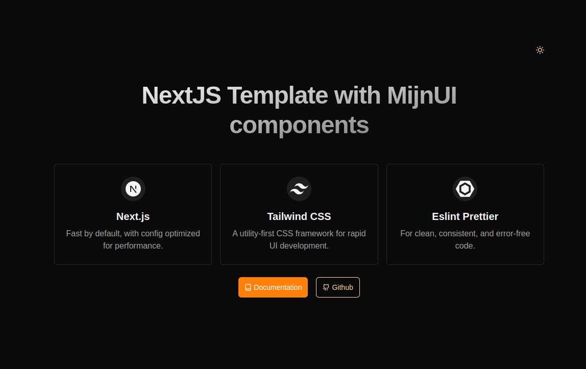

# 🚀 Next.js 15 Template for MijnUI Components

This is a starter template to help you quickly build apps using MijnUI Components.s

## Features

- **React Icons:** Add icons effortlessly.
- **Radix UI Primitives:** Build accessible UI elements.
- **Tailwind CSS Class Sorting:** Keeps your styles tidy.
- **ESLint v9:** Spot and fix issues as you code.
- **Prettier Integration:** Import sorting, Tailwind class sorting, and works with ESLint.
- **Light and Dark Mode:** Switch themes with next-themes.

### How to Use

1. Clone the template:

```bash
  git clone https://github.com/mijn-ui/nextjs-template
  cd nextjs-template
```

2. Install dependicies:

```bash
  npm install
```

3. Start the development server:

```bash
  npm run dev
```

That's it—you're all set! 🎉

## Preview


